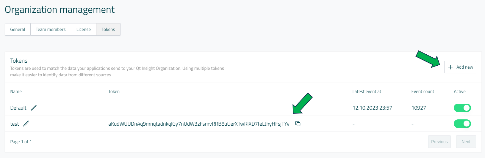
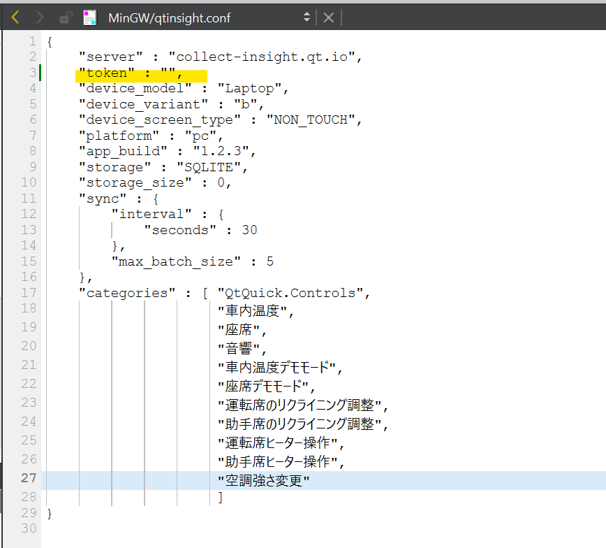
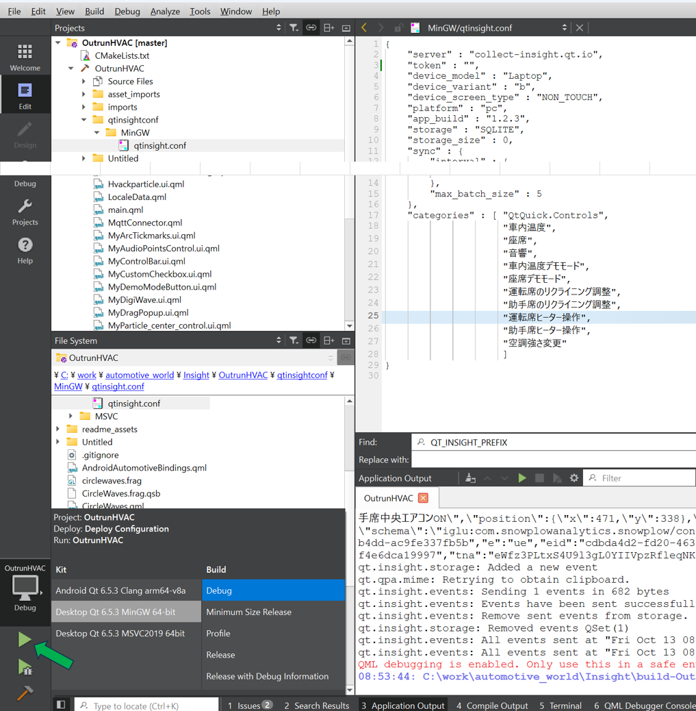
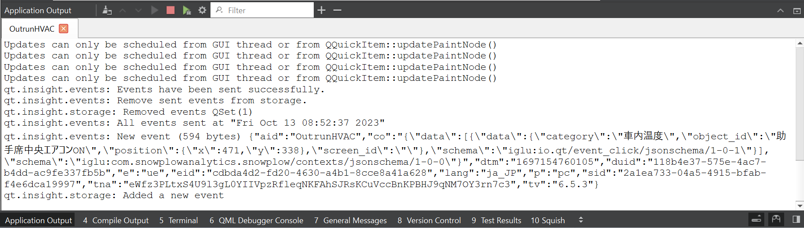
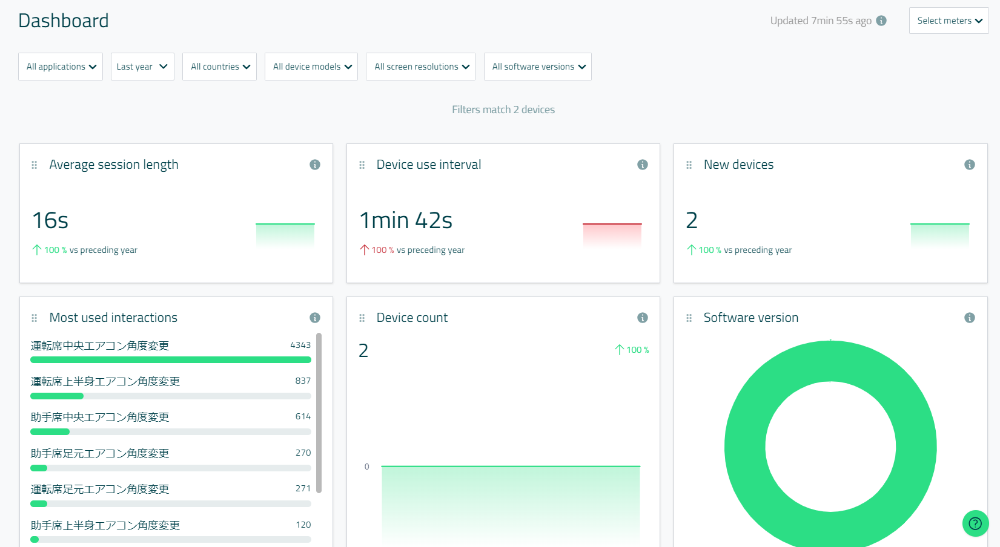

# Qt Insigt + Outrun HVACデモ
## 動作確認済み環境
- ホストマシン：Windows 11ホスト
- Qtバージョン・キット
  - Desktop Qt 6.5.3 MSVC2019 64-bit
  - Desktop Qt 6.5.3 MinGW 64-bit
  - Android Qt 6.5.3 Clang arm64-v8 (Debugビルドのみテスト済み)
    - 実機はAndroid Tablet(tangorpro)でテスト済み
- 依存モジュール
    - Qt::Core
    - Qt::Gui
    - Qt::Mqtt
    - Qt::Quick
    - Qt::Quick3D
    - Qt::QuickStudioEffects
      - [android/qqdc_Android-6.5.2-arm64v8a/qqdc_Android-6.5.2-arm64v8a_Debug](android/qqdc_Android-6.5.2-arm64v8a/qqdc_Android-6.5.2-arm64v8a_Debug)の中のフォルダすべてを、Qt/6.5.3/android_arm64_v8a直下にペーストして下さい。そうすることでQt::QuickStudioEffectsを使用可能になります。
    - Qt::InsightTracker
  
  ## 使用方法
  1. Qt Insightでオーガニゼーションを作成します。[こちら](https://insight.qt.io/app)のリンクから無料で評価版を利用可能です。
  2. 上記「依存モジュール」をMaintenancetoolでインストールします。
  3. Qt Insight Web ConsoleのOrganization managementのTokensタブで新規のトークンを発行します。
  
  4. 発行したトークンを、[qtinsightconf](qtinsightconf)フォルダ以下にあるそれぞれのフォルダの、qtinsight.confファイルの"token"のエリアの値として貼り付けます。これでデータをクラウドに送信可能になります。
  
  5. Qtバージョン・キットに記載のあるキットのいずれかでアプリケーションをビルドし、実行します。※2023年10月時点ではデバッグビルドのみ可能です。それ以外のビルドを行う場合は、Qt::QuickStudioEffectsをDebugビルドではなく、対応のビルド種類でビルドし、インストールする必要があります。
  
  6. 起動したアプリケーションを操作すると、Qt CreatorのApplication Outputセクションにデータ保存と送信のログが表示されます。
  
  7. 少しすると、Qt Insight Web Consoleに送信されたデータが反映されます。
  